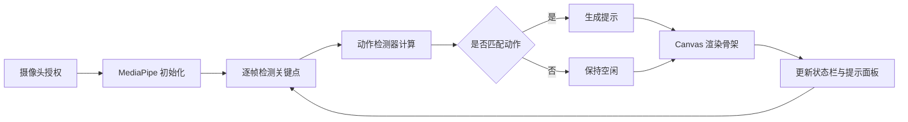

# 视觉动作捕捉系统 - 产品需求文档 (PRD)

## 1. 产品概述

基于浏览器的实时人体姿态捕捉与动作识别系统,通过摄像头采集视频流,使用 MediaPipe Tasks Vision 进行骨骼点检测,在 Canvas 上实时渲染人体骨架,并对 6 种预设动作进行识别,基于动作完成度与姿态准确度输出 4 类反馈提示。

- **目标用户**:健身/康复/体育训练辅助、互动教学、动作演示工具的开发者与使用者
- **核心价值**:无需安装客户端、纯浏览器运行、低延迟、可扩展的提示规则

## 2. 核心功能

### 2.1 用户角色

| 角色 | 使用方式 | 权限 |
|------|----------|------|
| 普通用户 | 浏览器访问 | 启停摄像头、查看姿态骨架与提示、调整检测灵敏度 |
| 开发者 | 通过配置文件扩展 | 自定义动作规则、调整阈值、扩展提示文案 |

### 2.2 功能模块

1. **主页面 (PoseCanvas)**:摄像头视频流 + Canvas 骨架叠加渲染 + 实时动作识别
2. **状态栏 (StatusBar)**:FPS、检测置信度、当前识别动作、姿态可见度
3. **提示面板 (PromptPanel)**:动作提示气泡、4 类提示分类展示
4. **控制面板 (ControlPanel)**:摄像头启停、动作选择、灵敏度调节、录制开关

### 2.3 页面详情

| 页面 | 模块 | 功能描述 |
|------|------|----------|
| 主页面 | 摄像头视图 | 启动后实时显示视频流,叠加骨架与关键点 |
| 主页面 | 骨架可视化 | 33 个关键点 + 35 条骨骼连线,带颜色编码 |
| 主页面 | 动作识别条 | 顶部横条显示当前匹配动作及置信度 |
| 状态栏 | 性能指标 | FPS / 端到端延迟 / 关键点可见数量 |
| 提示面板 | 4 类提示 | 鼓励 / 纠正 / 警告 / 完成,滚动列表 |
| 控制面板 | 检测设置 | 灵敏度滑块、目标动作勾选、镜像开关 |

## 3. 核心流程

用户授权摄像头 → MediaPipe Pose Landmarker 初始化 → 每帧检测 33 个关键点 → ActionDetector 计算关节角度与位置关系 → 匹配 6 种动作模式 → 生成对应类别提示 → Visualizer 渲染骨架 → PromptPanel 显示提示 → 状态栏更新性能数据。

## 4. 用户界面设计

### 4.1 设计风格

- **主色调**:深色背景 (#0B0F14) + 青绿色骨架 (#22E3A0) + 琥珀色高亮 (#FFB020),营造科技感与冷静专注的氛围
- **强调色**:4 类提示分别使用绿(鼓励)、青(纠正)、橙(警告)、白(完成)
- **字体**:标题用 `Space Grotesk`,正文用 `Inter`,数字用 `JetBrains Mono`
- **布局**:桌面优先,左侧主画面 + 右侧信息面板的三栏式布局
- **图标**:线性图标(lucide-vue-next),简洁锐利
- **氛围**:网格背景 + 关键点辉光 + 骨架描边动画

### 4.2 页面设计概览

| 页面 | 模块 | UI 元素 |
|------|------|---------|
| 主页面 | 视频区 | 16:9 视频容器,叠加 Canvas,边角扫描线动画 |
| 主页面 | 动作识别条 | 顶部贴边,显示动作名 + 置信度进度条 |
| 状态栏 | 指标行 | 三列等分:FPS / 延迟 / 关键点数,等宽字体 |
| 提示面板 | 提示卡片 | 时间戳 + 类型徽章 + 文案,新条目滑入动画 |
| 控制面板 | 设置区 | 折叠分组:摄像头 / 检测 / 提示 / 录制 |

### 4.3 响应式

- **桌面端 (≥ 1024px)**:三栏布局,主画面占 65%,右侧面板 35%
- **平板 (768-1023px)**:主画面在上,控制与提示折叠为标签页
- **移动端 (< 768px)**:单栏,画面优先,提示与控制可上滑展开

### 4.4 动作定义(6 种)

| 动作 | 关键判定 |
|------|----------|
| 举手 (HandRaise) | 单/双手腕高于肩膀 |
| 深蹲 (Squat) | 膝盖角度 < 110° 且髋部下降 |
| 跳跃 (Jump) | 双脚同时离地(踝 y 坐标突增) |
| 鞠躬 (Bow) | 躯干前倾角 > 45° |
| 挥手 (Wave) | 单手腕左右摆动频率 > 2Hz |
| 转身 (Turn) | 双肩连线水平角度变化 > 30° |

### 4.5 提示类别(4 类)

| 类别 | 触发场景 | 文案示例 |
|------|----------|----------|
| 鼓励 (Encourage) | 动作完成度高 | "做得很好,继续保持节奏!" |
| 纠正 (Correct) | 姿态偏差但未失败 | "膝盖稍微外展,与脚尖同向" |
| 警告 (Warn) | 关键点丢失或姿态危险 | "请确保全身在画面内" |
| 完成 (Complete) | 动作连续达标 N 帧 | "深蹲完成 1 次,共 8 次" |

## 5. 非功能需求

- **性能**:端到端延迟 < 80ms,目标 30 FPS
- **兼容性**:Chrome / Edge 最新版,需要 WebGL2 与 WebAssembly 支持
- **隐私**:视频帧仅在浏览器本地处理,不上传服务器
- **可扩展**:动作规则与提示规则配置化,可在 `config.ts` 修改
