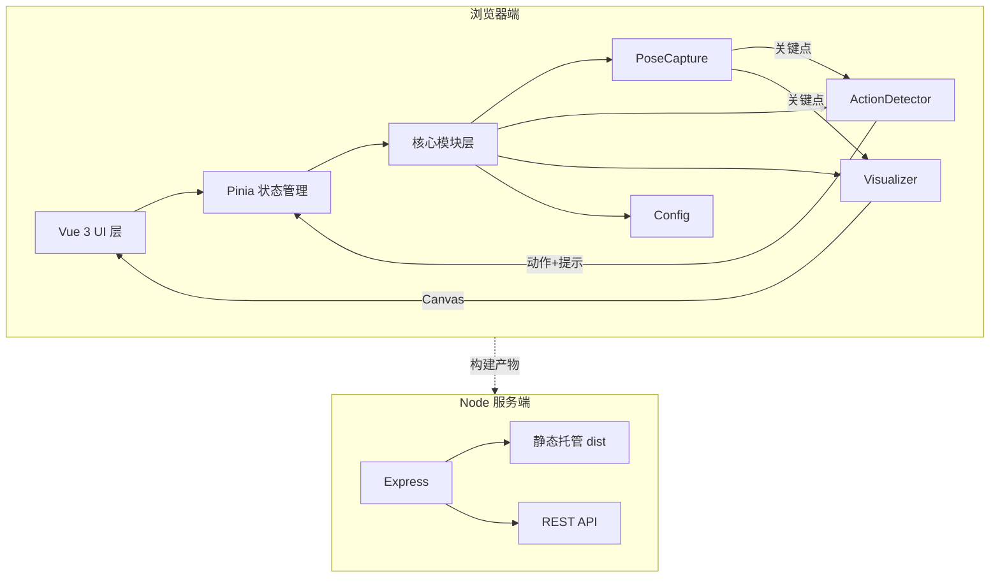
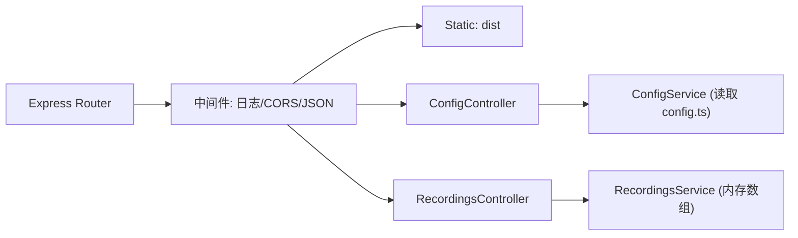

# 视觉动作捕捉系统 - 技术架构文档

## 1. 架构设计



## 2. 技术说明

- **前端**:Vue@3 + TypeScript + Vite + TailwindCSS
- **状态管理**:Pinia(`src/stores/system.ts`)
- **姿态检测**:`@mediapipe/tasks-vision`(PoseLandmarker,33 关键点)
- **可视化**:原生 Canvas 2D API(`src/modules/Visualizer.ts`)
- **图标**:`lucide-vue-next`
- **后端**:Express@4,仅提供静态托管与配置 API
- **构建工具**:Vite 5
- **初始化工具**:`vite-init` 模板 `vue-express-ts`

## 3. 路由定义

| 路由 | 用途 |
|------|------|
| `/` | 主应用页面(摄像头 + 骨架 + 提示) |
| `/config` | 配置预览页(只读展示当前 `config.ts` 规则) |

## 4. API 定义

### 4.1 配置下发

```ts
// GET /api/config
interface SystemConfigResponse {
  actions: ActionRule[];
  promptTemplates: PromptTemplate[];
  defaults: {
    sensitivity: number;       // 0-1
    mirror: boolean;
    targetFps: number;
  };
}
```

### 4.2 录制片段保存(可选)

```ts
// POST /api/recordings
interface RecordingPayload {
  action: string;
  timestamp: number;
  durationMs: number;
  confidence: number;
}
interface RecordingResponse { id: string; savedAt: number; }
```

### 4.3 健康检查

```ts
// GET /api/health -> { ok: true, ts: number }
```

## 5. 服务端架构



## 6. 核心模块设计

### 6.1 PoseCapture

```ts
class PoseCapture {
  constructor(video: HTMLVideoElement, canvas: HTMLCanvasElement, opts?: PoseCaptureOptions);
  async init(): Promise<void>;             // 加载 wasm + 模型
  start(): void;                           // 启动 RAF 循环
  stop(): void;
  onResult(cb: (r: PoseFrameResult) => void): void;
}

interface PoseFrameResult {
  landmarks: NormalizedLandmark[];         // 33 点
  worldLandmarks?: NormalizedLandmark[];
  handedness?: never;
  timestampMs: number;
  fps: number;
}
```

### 6.2 ActionDetector

```ts
class ActionDetector {
  constructor(config: ActionRule[]);
  detect(frame: PoseFrameResult): DetectionResult;
}

interface ActionRule {
  id: string;                              // 'squat'
  name: string;                            // '深蹲'
  evaluate: (lm: NormalizedLandmark[], history: FrameHistory) => ActionState;
}

interface DetectionResult {
  current: string | null;                  // 当前动作 id
  confidence: number;                      // 0-1
  state: Record<string, ActionState>;
  prompt?: PromptPayload;
}
```

### 6.3 Visualizer

```ts
class Visualizer {
  constructor(ctx: CanvasRenderingContext2D, opts?: VisualizerOptions);
  render(frame: PoseFrameResult, extra?: RenderExtra): void;
  clear(): void;
}
```

### 6.4 配置(config.ts)

```ts
export interface AppConfig {
  modelPath: string;                       // wasm/模型 URL
  camera: { width: number; height: number; facingMode: 'user' | 'environment' };
  detection: { minDetectionConfidence: number; minTrackingConfidence: number; minPresenceConfidence: number };
  actions: ActionRule[];
  prompts: PromptTemplate[];
  ui: { mirror: boolean; showWorldLandmarks: boolean; skeletonStyle: SkeletonStyle };
}
```

## 7. 类型定义(src/types/index.ts)

```ts
import type { NormalizedLandmark } from '@mediapipe/tasks-vision';

export type ActionType = 'handRaise' | 'squat' | 'jump' | 'bow' | 'wave' | 'turn';
export type PromptType = 'encourage' | 'correct' | 'warn' | 'complete';

export interface ActionState { active: boolean; confidence: number; meta?: Record<string, number>; }
export interface PromptPayload { type: PromptType; message: string; action?: ActionType; }
export interface PromptTemplate { type: PromptType; action?: ActionType; messages: string[]; }
export interface FrameHistory { frames: PoseFrameResult[]; maxLen: number; }
export interface PoseFrameResult { landmarks: NormalizedLandmark[]; worldLandmarks?: NormalizedLandmark[]; timestampMs: number; fps: number; }
export interface PoseCaptureOptions { width?: number; height?: number; mirror?: boolean; }
export interface VisualizerOptions { lineWidth?: number; pointRadius?: number; accentColor?: string; }
export interface SkeletonStyle { lineColor: string; pointColor: string; highlightColor: string; }
export interface RenderExtra { currentAction?: string | null; confidence?: number; }
```

## 8. 数据流

1. 用户点击 `开始` → `ControlPanel` 调用 `systemStore.startCapture()`
2. `systemStore` 实例化 `PoseCapture` → `init()` 加载模型 → `start()` 启动 RAF
3. 每帧 `PoseCapture` 回调 → 同步驱动 `ActionDetector.detect()` 与 `Visualizer.render()`
4. 检测结果写入 `systemStore.detection`,提示写入 `systemStore.prompts`(保留最近 50 条)
5. UI 组件响应式读取 store,自动更新
6. 用户点击 `停止` → `systemStore.stopCapture()`,释放摄像头与 RAF

## 9. 目录结构

```
visual_capture_system_node/
├── server/
│   └── index.ts              # Express 后端 (静态服务 + API)
├── src/
│   ├── modules/
│   │   ├── PoseCapture.ts    # MediaPipe 姿态捕捉封装
│   │   ├── ActionDetector.ts # 6 种动作 + 4 类提示
│   │   ├── Visualizer.ts     # Canvas 渲染
│   │   └── config.ts         # 配置与动作规则
│   ├── components/
│   │   ├── PoseCanvas.vue    # 摄像头 + Canvas 主组件
│   │   ├── PromptPanel.vue   # 提示面板
│   │   ├── StatusBar.vue     # 状态栏
│   │   └── ControlPanel.vue  # 控制按钮
│   ├── stores/
│   │   └── system.ts         # Pinia 状态管理
│   ├── types/
│   │   └── index.ts          # 类型定义
│   ├── App.vue
│   └── main.ts
├── index.html
├── package.json
├── vite.config.ts
├── tsconfig.json
└── tailwind.config.js
```

## 10. 性能与隐私策略

- MediaPipe wasm 与模型走 CDN,首次加载后浏览器缓存
- 视频帧不离开浏览器,服务端不接收图像数据
- Canvas 渲染使用 `requestAnimationFrame` 与帧率限制(目标 30 FPS)
- `ActionDetector` 维护滚动 5 帧窗口用于动作稳定性判定(防抖)
